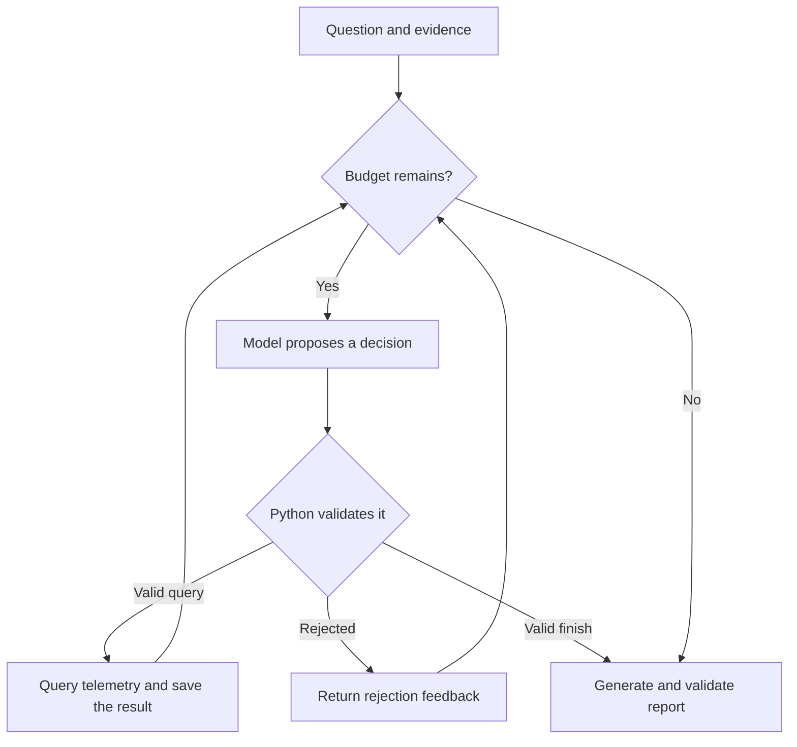

# Learning AI Agents Through Incident Analysis

Why did checkout requests become slow? Build an agent that investigates using
metrics, logs, and traces—and learn how to check its work.

This is a small Python learning project for engineers familiar with observability.
No previous AI-agent experience is needed. New to telemetry? Read the
[short prerequisite guide](prerequisites/README.md).

## The experiment

Run the same client load with a connection pool of **10**, then **2**. Ask the
agent to explain the latency change using evidence. Compare a fixed set of queries
with an agent that chooses what to investigate next.

## What you'll learn

| Concept | You'll see it when… |
| --- | --- |
| Inference | The model proposes an explanation |
| Agent loop | It chooses a query, reads the result, and decides what comes next |
| Tool use | It queries Prometheus, Loki, and Tempo |
| State | Earlier evidence informs the next decision |
| Guardrails | Python enforces permissions and execution limits |
| Recovery | A rejected query gets feedback for correction |
| Evaluation | You compare the answer with the experiment's evidence |
| Observability | You inspect saved decisions, results, usage, and failures |
| Human approval | You approve or reject a simulated action |

## Quick start

You need **Python 3.11+**, **Docker Compose**, and an API key for model-powered
investigation. Provider quotas and charges depend on your account.

1. **[Run the demo](docs/run-demo.md)** — install, start the stack, generate traffic,
   and ask the agent to investigate. All commands are in one place.
2. **[Understand the agent](docs/how-it-works.md)** — follow the code and inspect
   the evidence, decisions, and report.
3. **[Evaluate its answer](evaluations/README.md)** — distinguish a completed run
   from a well-supported diagnosis.

Want to look around first? Read [one successful and one failed run](examples/README.md).

## The agent loop

The model proposes the next step. Python checks whether it is allowed.
Here, taking action means a read-only telemetry query.



Reporting needs usable evidence. Provider failures stop the run and preserve progress.

## Check it locally

After installing the project, run the offline tests without Docker or an API key:

```sh
.venv/bin/python -m unittest discover -s tests -v
```

[CI](https://github.com/lalitb/incident-agent/actions/workflows/sanity.yml) runs the
suite on Python 3.11 and 3.14, plus dependency, syntax, and Compose checks.

**Learning boundary:** Python validates structured measurements and citation
references. You review interpretations and recommendations. Approval is a
simulation—it makes no infrastructure changes.
