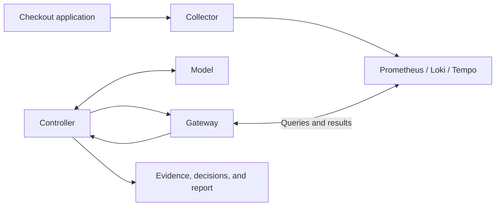
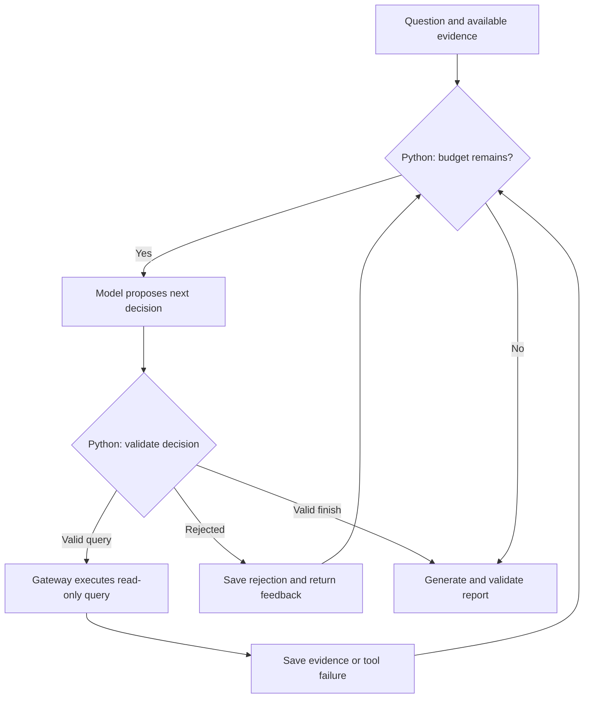

# Learning AI Agents Through Incident Analysis

A small Python project for learning how AI agents choose tools, gather evidence,
operate within guardrails, and produce an incident diagnosis.

The agent investigates a local checkout application using metrics, logs, and
traces. It supports fixed collection and model-directed investigation, saves each
run, and includes an approval simulation. Reports need human review; remediation
never changes real infrastructure.

**Who this is for:** engineers familiar with basic Python and observability who
want to understand tool-using AI agents. No prior agent-framework experience is
required. If observability is new to you, start with the
[observability prerequisites](prerequisites/README.md).

## What you'll learn

| Concept | Where it appears |
| --- | --- |
| Inference | The model chooses queries and proposes a diagnosis |
| Agent loop | Repeatedly choose a query, validate it, collect evidence, and decide whether to continue or stop |
| Tool use | Typed queries to Prometheus, Loki, and Tempo |
| State | Evidence and decisions carried across planning steps |
| Guardrails | Tool, service, time-window, argument, and execution limits |
| Recovery | Rejected decisions returned to the planner for correction |
| Evaluation | Offline checks and separately reviewed model answers |
| Observability | Decisions, tool results, durations, usage, and failures |
| Human approval | Approval or rejection of a simulated action |

## Architecture



PostgreSQL supports the demo application. Grafana is available for human inspection
at <http://localhost:3000>. ClickHouse is excluded from the default stack; its
configuration is preserved in an [optional SQL exercise](exercises/clickhouse/README.md).

## The demo incident

Compare a baseline pool of **10** connections with an incident pool of **2** under
the same load-generator settings. The experiment uses ten concurrent clients and
configured database work of 0.2 seconds. Equal client concurrency does not mean
equal throughput: each client waits for its response.

Historical example results, not guaranteed outputs: client mean latency rose from
about 212 ms to 1,029 ms; client p95 rose from 218 ms to 1,047 ms. Selected incident
traces measured 818–838 ms acquiring a connection and 204–205 ms executing the
query. Client percentiles, server metric means, and individual trace durations
measure different things. The [original experiment](examples/ground_truth.json)
records the conditions separately from the model's answers.

## Prerequisites and configuration

You should know basic Python, JSON, terminal commands, and HTTP requests.
The [short observability guide](prerequisites/README.md) covers the remaining
basics using this demo. Advanced telemetry query languages are not required.

Python **3.14.6** was used locally; the agent declares Python 3.11+. You also need
Docker Compose, a running container engine, and free ports for the
[telemetry services](telemetry-lab/compose.yaml) and the experiment on port 8011.

The agent loads `.env` through `python-dotenv`; existing environment variables
win. [.env.example](.env.example) contains blank credentials and uses
`LLM_MODEL=moonshot/kimi-k3` with `MOONSHOT_API_KEY`, the last model exercised live.
Gemini, OpenRouter, and OpenAI configuration alternatives are listed there too;
they are not a promise of model availability. Keep `.env` and `kimi-key` private.

Provider availability, quotas, and charges depend on your account. Moonshot and
OpenAI are not assumed free. OpenRouter requires an explicit `:free` model and
requests zero pricing with provider fallback disabled. No billing is enabled and
no provider is switched automatically.

Collection needs telemetry backends but no API key. Diagnosis and report replay
need a key. Tests, saved-run evaluation, and simulated approval work offline.

## Quick start

Run from the project root, using the same terminal. Separate virtual environments
keep the demo's pinned telemetry dependencies apart from the agent.

```sh
git clone https://github.com/lalitb/incident-agent.git
cd incident-agent

python3 -m venv .venv
.venv/bin/python -m pip install .
python3 -m venv .venv-demo
.venv-demo/bin/python -m pip install -r demo/requirements.txt

# Create only if absent; edit locally to supply your model and key.
test -f .env || cp .env.example .env

docker compose -f telemetry-lab/compose.yaml up -d --wait
```

The experiment helper starts the checkout app on port 8011, verifies each pool
setting, generates 60 seconds of traffic per phase, waits for export, and stops
its app processes. Allow about three minutes. Other checkout traffic can mix
into this service window; stop that traffic for a clean comparison.

```sh
EXPERIMENT="runs/experiment-$(date -u +%Y%m%dT%H%M%SZ)"
.venv/bin/python -u -m evaluations.experiment "$EXPERIMENT" \
  --python "$PWD/.venv-demo/bin/python" --seconds 60

START=$(.venv/bin/python -c 'import json,sys; print(json.load(open(sys.argv[1]))["window"]["start"])' "$EXPERIMENT/ground_truth.json")
END=$(.venv/bin/python -c 'import json,sys; print(json.load(open(sys.argv[1]))["window"]["end"])' "$EXPERIMENT/ground_truth.json")
printf 'Investigation window: %s to %s\n' "$START" "$END"
```

Use a completed experiment's window. `ground_truth.json` records actual UTC times,
configuration, and client measurements; only its window is passed to diagnosis.
Collection requires explicit timezone-aware start/end values at most one hour
apart. Historical windows stop working when backend retention expires.

```sh
# Fixed collection without inference or an API key
.venv/bin/python -m agent.diagnose --collect-only --start "$START" --end "$END"

# Fixed collection plus a model-generated report
.venv/bin/python -u -m agent.diagnose --start "$START" --end "$END"

# Adaptive collection plus a report, on the same window and model
.venv/bin/python -u -m agent.diagnose --adaptive --start "$START" --end "$END"

# Replace <RUN_ID> with the ID printed as "Run directory: runs/...".
.venv/bin/python -m agent.evaluate "runs/<RUN_ID>" --scenario incident
```

Run diagnosis commands separately; request pacing is per process. To isolate
report generation from telemetry collection, replay saved evidence. This makes
one logical model call and uses the saved window, so omit `--start` and `--end`:

```sh
.venv/bin/python -m agent.diagnose --evidence-file "runs/<RUN_ID>/evidence.json"
```

## How the investigation works

**The agent loop:** Observe → Decide → Check → Act → Observe again.

The model chooses the next query using the evidence collected so far. Python
validates and executes permitted queries, saves the evidence, and returns results
or rejection feedback to the model. The loop ends when the model finishes or a
limit is reached. Here, “act” means a read-only telemetry query—not remediation.
Finally, the model produces a structured report for validation.



Reporting needs usable evidence. Provider errors preserve progress and stop the
run; they do not produce an invented diagnosis.

- Adaptive mode allows **six planning calls and eight attempted telemetry calls**,
  plus at most one separate report call. A rejected decision consumes a planning
  step; a failed telemetry call consumes tool budget.
- The entire batch is checked before any tool runs. Service/window are fixed,
  tools and arguments are allowlisted, identical queries cannot repeat, and
  `get_trace` requires a trace ID discovered in this investigation.
- Declared verification gaps block `finish` and require targeted investigation
  while budgets remain. This policy is unchanged by the reporting cleanup.
- Fixed mode has no planning calls: seven queries plus up to three trace retrievals.
- Model requests start at least 30 seconds apart within a process. HTTP 429 can
  trigger at most three retries per logical call, waiting 60, 120, then 180 seconds.
  A longer provider delay is honored only within the 180-second wait limit;
  otherwise the call stops. Recognized daily/zero quotas and other provider errors
  stop without retrying. SDK retries are disabled. Provider attempts and waits
  are recorded separately from logical planning/report calls.

## The reporting boundary

**The application validates report structure, citation references, and structured
measurements. Narrative interpretations and recommendations require human review.**

Trace breakdowns identify the cited trace and each span's ID, name, and duration.
Configuration observations identify the cited pool setting and service version.
Metric observations identify the metric, labels, bucket, statistic, value, and unit.
For example, this illustrates the shape of a metric observation, not a real result:

```json
{
  "evidence_id": "example-metric-id",
  "metric": "connection_wait_mean_seconds",
  "labels": {"service_version": "v2"},
  "bucket_start_utc": "2026-09-20T14:18:00Z",
  "statistic": "sample_mean",
  "value": 0.8362,
  "unit": "seconds"
}
```

Python recomputes the bucket statistic from the cited evidence and checks it.
It does not parse arbitrary numbers in prose or prove that a recommendation will
work. Timeline provenance checks and the confidence downgrade for unverified
hypotheses remain. This deliberately replaces the earlier prose-number contract.

## Reading the code and a saved run

Follow this path first; tests and evaluation history can wait:

1. [diagnose.py](agent/diagnose.py): CLI, fixed baseline, collection, and checkpoint files.
2. [controller.py](agent/controller.py): adaptive question → decision → bounded tool calls.
3. [gateway.py](agent/gateway.py): scope, argument checks, redaction, and tool dispatch.
4. [tools/telemetry.py](agent/tools/telemetry.py): read-only backend queries and evidence records.
5. [model.py](agent/model.py) and [schemas.py](agent/schemas.py): evidence summary, report instructions, and output shape. [llm.py](agent/llm.py) handles provider calls.
6. [validate_report.py](agent/validate_report.py): structured observations checked against evidence. [remediate.py](agent/remediate.py) demonstrates approval separately.

| File | What to inspect |
| --- | --- |
| `evidence.json` | Queries, source results, evidence IDs, durations, and errors |
| `controller.json` | Decisions/reasons, rejections, usage, termination, and report status |
| `report.json` | Validated structured observations, hypothesis, uncertainty, and proposals |

`report.json` is absent after report failure, no evidence, or collection-only mode.
Local report rejection can leave `report_rejected.json` and a sanitized reason in
`controller.json`'s `failure.detail`. Malformed provider output is not saved.
Usage is provider-reported or `null` (unknown); cost and hidden chain-of-thought
are not recorded. `agent.evaluate` can inspect one source with `--evidence-id`.

## Tests and evaluations

```sh
.venv/bin/python -m unittest discover -s tests -v
```

The suite is self-contained and offline. It covers budgets, recovery, scope,
redaction, failures, structured reporting, and approval. Tests for the retired
prose parser are archived; keeping the previous count of 91 is not a goal.

Actual-model evaluations separately assess conclusions, claim support, uncertainty,
and behavior under injected content. Live integration checks that collection and
reporting finish together. See the [evaluation guide](evaluations/README.md) and
[one successful and one failed run](examples/README.md). Selected sanitized artifacts are included; the complete local development
archive is excluded from this repository.

## Approval simulation

For a successful report using the current schema:

```sh
RUN="runs/<RUN_ID>"
.venv/bin/python -m agent.remediate "$RUN"           # proposal only
.venv/bin/python -m agent.remediate "$RUN" --approve # explicit approval
# Or, instead of approval:
.venv/bin/python -m agent.remediate "$RUN" --reject
```

A new proposal defaults to `not_requested`. Approval/rejection updates
`remediation.json` and controller status. **It executes no shell command,
deployment change, or database mutation.**

## Current results and limitations

The preserved Kimi K3 integration run completed collection and reporting, recovered
from a rejected decision, and used retained telemetry. It retrieved no traces,
leaving acquisition versus query duration unresolved with two tool calls unused.
That gap appeared only in final reporting. Some causal/timing wording exceeded
the evidence; saved-evidence report failures also remain recorded.

Those results use the previous report contract. The cleanup is verified offline;
a fresh actual-model run under the new schema is still needed. Common-pattern
redaction is incomplete, injection resistance is not proven, and deterministic
validation is not general fact-checking. Bucket boundaries are not exact incident
times, startup logs are not deployment proof, and selected traces are not population
averages. RAG and additional backends belong in separate exercises.

## Troubleshooting and cleanup

- **No telemetry:** check the UTC window, traffic, and `docker compose -f telemetry-lab/compose.yaml ps`. Generate a fresh experiment if data expired.
- **Provider failure:** inspect model metadata, attempts, and retry stop reason in `controller.json`. Check your account quota and `.env`; existing environment variables override it.
- **Rejected decision:** inspect the validation error and subsequent recovery in `controller.json`.
- **Rejected report:** inspect `failure.detail`, the candidate, and cited evidence. Do not relax measurement checks to accept an invented value.

The experiment stops its app processes. Stop the telemetry environment while
preserving its containers and volumes with:

```sh
docker compose -f telemetry-lab/compose.yaml stop
```

Avoid `down -v` when preserving data. Stopping containers does not extend retention.
If ClickHouse was already running before cleanup, follow the optional exercise's
stop command; configuration edits do not stop existing containers. Deeper design
trade-offs belong in the companion Medium article; its link is pending publication.
