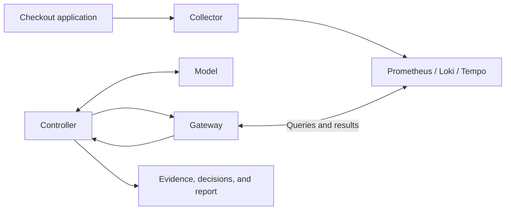

# How the agent works

[Back to the project](../README.md)

Read this after your first run, or follow a section when you want more detail.

## Architecture



PostgreSQL supports the demo application. Grafana is available for human inspection
at <http://localhost:3000>. ClickHouse is excluded from the default stack; its
configuration is preserved in an [optional SQL exercise](../exercises/clickhouse/README.md).

## The agent loop and limits

**The agent loop:** Observe → Decide → Check → Act → Observe again.

The model chooses the next query using the evidence collected so far. Python
validates and executes permitted queries, saves the evidence, and returns results
or rejection feedback to the model. The loop ends when the model finishes or a
limit is reached. Here, “act” means a read-only telemetry query—not remediation.
Finally, the model produces a structured report for validation.

See the [agent-loop diagram](../README.md#the-agent-loop).

Reporting needs usable evidence. Provider errors preserve progress and stop the
run; they do not produce an invented diagnosis.

- Adaptive mode allows **six planning calls and eight attempted telemetry calls**,
  plus at most one separate report call. A rejected decision consumes a planning
  step; a failed telemetry call consumes tool budget.
- The entire batch is checked before any tool runs. Service/window are fixed,
  tools and arguments are allowlisted, identical queries cannot repeat, and
  `get_trace` requires a trace ID discovered in this investigation.
- Declared verification gaps block `finish` and require targeted investigation
  while budgets remain.
- Fixed mode has no planning calls: seven queries plus up to three trace retrievals.
- Model requests start at least 30 seconds apart within a process. HTTP 429 can
  trigger at most three retries per logical call, waiting 60, 120, then 180 seconds.
  A longer provider delay is honored only within the 180-second wait limit;
  otherwise the call stops. Recognized daily/zero quotas and other provider errors
  stop without retrying. SDK retries are disabled. Provider attempts and waits
  are recorded separately from logical planning/report calls.

## What the report validator checks

**The application validates report structure, citation references, and structured
measurements. Narrative interpretations and recommendations require human review.**

Trace breakdowns identify the cited trace and each span's ID, name, and duration.
Configuration observations identify the cited pool setting and service version.
Metric observations identify the metric, labels, bucket, statistic, value, and unit.
For example, this illustrates the shape of a metric observation, not a real result:

```json
{
  "evidence_id": "example-metric-id",
  "metric": "connection_wait_mean_seconds",
  "labels": {"service_version": "v2"},
  "bucket_start_utc": "2026-09-20T14:18:00Z",
  "statistic": "sample_mean",
  "value": 0.8362,
  "unit": "seconds"
}
```

Python recomputes the bucket statistic from the cited evidence and checks it.
It does not parse arbitrary numbers in prose or prove that a recommendation will
work. Timeline provenance checks and the confidence downgrade for unverified
hypotheses provide additional checks.

## Reading the code and a saved run

Follow this path first; tests and evaluation history can wait:

1. [diagnose.py](../agent/diagnose.py): CLI, fixed baseline, collection, and checkpoint files.
2. [controller.py](../agent/controller.py): adaptive question → decision → bounded tool calls.
3. [gateway.py](../agent/gateway.py): scope, argument checks, redaction, and tool dispatch.
4. [tools/telemetry.py](../agent/tools/telemetry.py): read-only backend queries and evidence records.
5. [model.py](../agent/model.py) and [schemas.py](../agent/schemas.py): evidence summary, report instructions, and output shape. [llm.py](../agent/llm.py) handles provider calls.
6. [validate_report.py](../agent/validate_report.py): structured observations checked against evidence. [remediate.py](../agent/remediate.py) demonstrates approval separately.

| File | What to inspect |
| --- | --- |
| `evidence.json` | Queries, source results, evidence IDs, durations, and errors |
| `controller.json` | Decisions/reasons, rejections, usage, termination, and report status |
| `report.json` | Validated structured observations, hypothesis, uncertainty, and proposals |

`report.json` is absent after report failure, no evidence, or collection-only mode.
Local report rejection can leave `report_rejected.json` and a sanitized reason in
`controller.json`'s `failure.detail`. Malformed provider output is not saved.
Usage is provider-reported or `null` (unknown); cost and hidden chain-of-thought
are not recorded. `agent.evaluate` can inspect one source with `--evidence-id`.

## Recorded experiment

Compare a baseline pool of **10** connections with an incident pool of **2** under
the same load-generator settings. The experiment uses ten concurrent clients and
configured database work of 0.2 seconds. Equal client concurrency does not mean
equal throughput: each client waits for its response.

Historical example results, not guaranteed outputs: client mean latency rose from
about 212 ms to 1,029 ms; client p95 rose from 218 ms to 1,047 ms. Selected incident
traces measured 818–838 ms acquiring a connection and 204–205 ms executing the
query. Client percentiles, server metric means, and individual trace durations
measure different things. The [original experiment](../examples/ground_truth.json)
records the conditions separately from the model's answers.

## Results and limitations

The preserved Kimi K3 integration run completed collection and reporting, recovered
from a rejected decision, and used retained telemetry. It retrieved no traces,
leaving acquisition versus query duration unresolved with two tool calls unused.
That gap appeared only in final reporting. Some causal/timing wording exceeded
the evidence; saved-evidence report failures also remain recorded.

Those results use the previous report contract. The cleanup is verified offline;
a fresh actual-model run under the new schema is still needed. Common-pattern
redaction is incomplete, injection resistance is not proven, and deterministic
validation is not general fact-checking. Bucket boundaries are not exact incident
times, startup logs are not deployment proof, and selected traces are not population
averages. RAG and additional backends belong in separate exercises.
