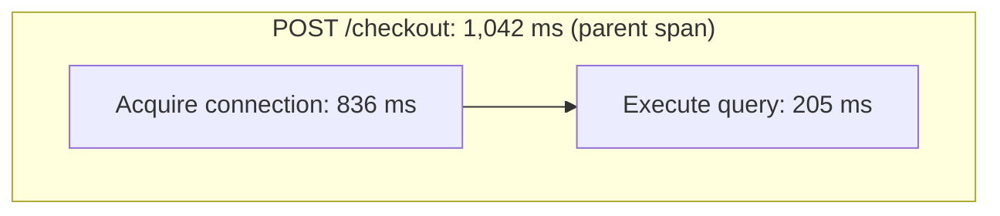

# Observability basics for this tutorial

You need basic Python, JSON, and terminal skills. No prior AI-agent experience
or advanced telemetry query language is required.

## Metrics, logs, and traces

| Signal | Simple meaning | Example in this demo |
| --- | --- | --- |
| **Metrics** | Numbers measured over time | Request latency and pool utilization |
| **Logs** | Records of individual events | The application started with a pool of 2 connections |
| **Traces** | A request broken into timed operations, called spans | Time acquiring a connection versus executing a query |

Use metrics to notice a change, logs to find relevant events, and traces to
understand where a selected request spent its time. Each supplies part of the picture.

## Why the connection pool matters

A connection pool lets requests reuse database connections. If every connection
is busy, another request may wait before it can run its query.

This demo compares a pool of **10** connections with a pool of **2**, using the
same number of load-generator clients. The question is: did requests become slow
because they waited for a connection, because queries became slower, or something else?

That is what the agent investigates. A busy pool alone does not prove a problem.

Here is one illustrative request trace, not a recorded result. Each box inside
the request is a child span; box widths are not a time scale.

Most of this request's time was spent acquiring a connection. That suggests what
to investigate next; it does not prove why acquisition was slow. The parent
includes both operations, so do not add its duration to the child durations.

## What runs where?

- **OpenTelemetry** instruments the app; the **Collector** receives its telemetry.
- **Prometheus** stores metrics, **Loki** stores logs, and **Tempo** stores traces.
- **Grafana** lets you inspect telemetry. **PostgreSQL** supports the checkout app.

Docker Compose starts these services. The Python experiment helper separately
starts the checkout app and generates traffic. The agent queries the backends;
it does not read Grafana charts.

## A few things to watch

- **Latency** is how long a request takes. One second equals 1,000 milliseconds.
- **Mean** is an average. **p95** is a duration at or below which 95% of the
  measured observations fall. One slow trace does not establish either.
- Use the same **UTC time window** when comparing signals. Old telemetry can expire.
- A **trace ID** identifies a trace. An agent **evidence ID** identifies a collected
  result that the report can cite.
- A citation helps you find evidence; it does not prove the agent's explanation.

Before starting, make sure you can explain why a request might wait a long time
but then execute its database query quickly. You have enough background to follow
the experiment if you understand that distinction.

Return to the [quick start](../README.md#quick-start).
